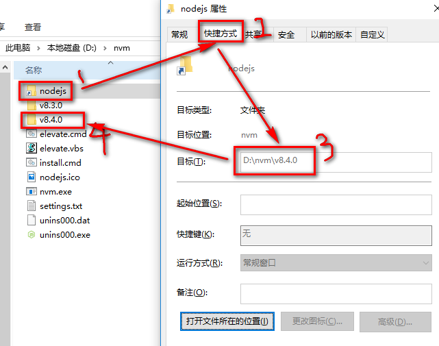

## 为了便于在未来开发中排出一些不必要的错误,以及灵活使用node,需要了解node nvm环境变量的配置方法

### 概念一
#### 环境变量是什么?
简单来说环境变量相当于,户口本中的地址,通过这个地址可以很轻松的找到你家的位置

1. 解压nvm压缩包
2. 在根目录中,找到setting.txt文件 如果没有改文件可以手动创建一个 
3. 内容

```JavaScript
root: d:\nvm  
path: D:\nvm\nodejs
```
```JavaScript
// root 是指 nvm根目录所在的路径
//path  是指nodejs 快捷方式所存放的位置
```
> 快捷方式指向的是nodejs所在的目录



例如上图中 名字为nodejs的快捷文件中,设置的地址最终指向了还是当前文件夹中 v8.4.0 
从上图其实我们还可以知道一个信息就是使用nvm  所谓的更换版本 其实更换的是 快捷方式中所设置的地址 


## 配置nvm的环境变量
windows 平台
### 方法一(很装逼的打开方式) 
1. ` win + R 打开运行窗口 `
2. ` 输入 sysdm.cpl  `
3. ` 高级>环境变量`

方法二 
自己找系统属性


